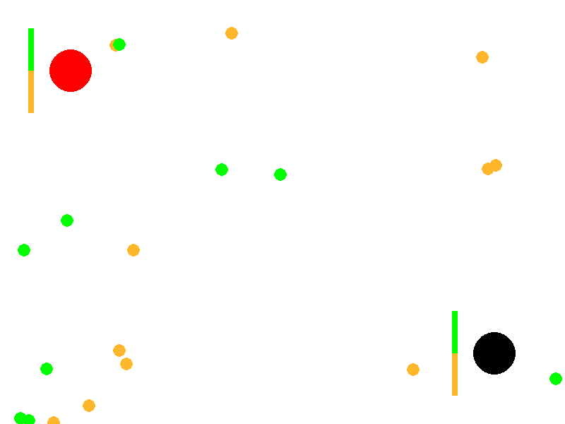
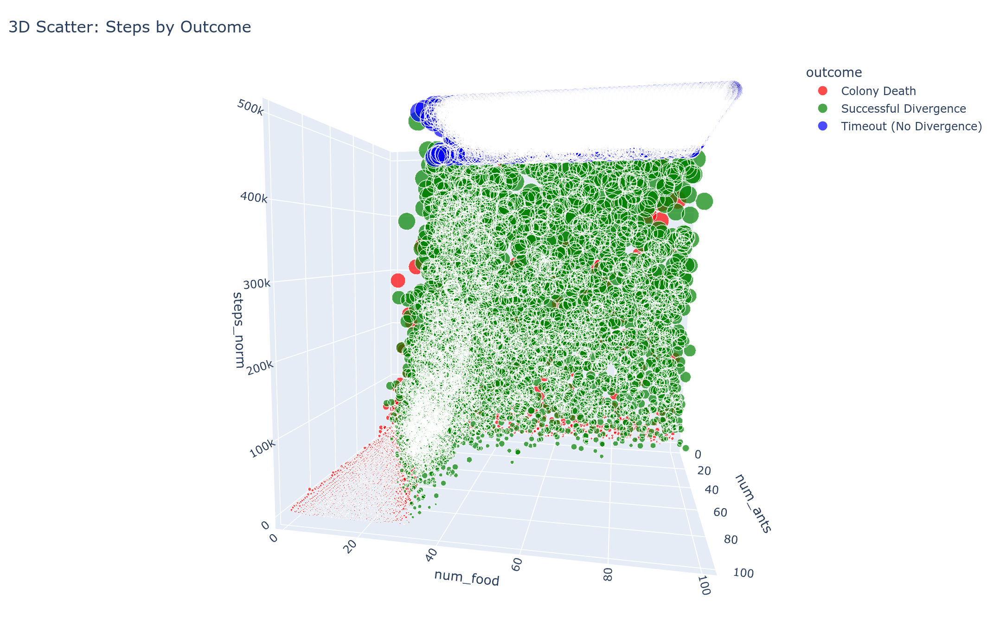

# Emergence from Simple Rules: A Two‑Colony Ant Simulation

## Summary

This article describes a conceptual simulation that explores how simple, local rules can produce complex collective behavior. Two ant colonies (red and black) forage in the same environment for two types of food (green and orange). Without any centralized control, reward function, or in‑lifetime learning, the colonies often drift toward specialization—one population comes to prefer green food, the other orange—thereby reducing direct competition. Depending on resource scarcity and conflict, the system either stabilizes into a specialized equilibrium or collapses when a colony goes extinct. For source code and details, see the **[GitHub repository](https://github.com/KintaroAI/ants)**.

---

## Why this matters

The setup is a compact testbed for studying:

* **Niche partitioning in ecology:** how competitors can spontaneously “split the market” by specializing in different resources.
* **Evolutionary dynamics:** preference traits are inherited with mutation, so adaptation emerges from selection rather than explicit optimization.
* **Conflict under scarcity:** competition over overlapping resources creates fights and deaths, shaping population trajectories.

---

## Model at a glance

**Environment.** A bounded two‑dimensional arena contains two stationary colony bases placed far apart, mobile ants from each colony, and scattered food items in two colors. Food respawns elsewhere when collected; if a carrier dies, the carried food is dropped and remains at that location—so availability stays roughly constant, but food can cluster around conflict zones.

**Ant trait.** Each ant has a single heritable trait—its **food preference**—a scalar in \[0, 1] (0 = fully orange, 1 = fully green). At “birth,” a new ant inherits its parent’s preference with a small random perturbation (mutation).

**Lifecycle and selection.** Ants wander, sense nearby items within a vision radius, and probabilistically target the color they prefer. Successful foragers reproduce; ants also engage enemies who carry their preferred food. Death (from fighting) removes traits from the population; reproduction amplifies them. Over time, this feedback can push colonies toward distinct specializations.

**No learning, no target function.** Individuals do not learn during their lifetime, and the system does not encode a fitness objective. Observers may define a “divergence” condition (e.g., one colony’s preference > 0.95 for green and the other < 0.05), but the outcome is emergent rather than imposed.

---

## Core dynamics

1. **Variation without learning**
   The only adaptation mechanism is **heritable variation**: when an ant returns food to its base, the colony spawns a new ant whose preference equals the parent’s plus a small mutation. Over many births and deaths, the colony‑level average preference drifts.

2. **Competition and conflict**
   Ants prefer to pick up food that matches their trait. If they detect an enemy carrying desirable food, they may chase and fight. Fights reduce life points and can lead to death; if a carrier dies, the food is dropped and stays where it fell.

3. **Emergent specialization**
   If both colonies target the same food type, they fight more and reproduce less. If they “split” the resource spectrum, they collide less, and each colony can sustain itself. The system thus tends to favor **resource partitioning** under scarcity.

4. **Non‑guaranteed outcomes**
   Specialization is common but not assured. The system also exhibits **preference swaps** (where roles flip) and **collapses** (where a colony dies out). Parameter choices influence how often each outcome occurs.

---

## Mechanics (conceptual)

* **Movement:** Ants roam with a mix of random wandering and goal‑directed motion toward sensed targets. Carriers slow down when returning to their colony to deposit food.
* **Sensing:** Within a vision radius, ants evaluate nearby food and enemy carriers and choose targets consistent with their trait.
* **Combat:** When opposing ants collide and at least one is carrying desirable food, both lose health each moment of contact; death drops any carried food, which remains where it is dropped.
* **Reproduction:** Depositing food at a colony spawns a new ant with a slightly mutated preference, creating a lineage of traits, and spawns food at a random place.
* **Colony accounting:** Colonies track their members and average preference; extinction occurs when a colony has no living ants.

---

## Typical parameters

These are representative, not prescriptive:

* **Population size:** \~80 ants total, split evenly between colonies.
* **Food availability:** \~40 items present at once, respawning on collection; dropped on death stays in place.
* **Speed:** Mobile ants move faster when foraging than when carrying.
* **Vision radius:** Finite sensing distance (e.g., on the order of a few body lengths).
* **Mutation size:** Small perturbations (e.g., ±0.1 on the 0–1 preference scale).
* **Duration:** Long runs (hundreds of thousands of steps) to allow population‑level shifts.

---

## Stop conditions (for analysis)

* **Time horizon reached** (maximum steps or wall‑clock time).
* **Preference divergence** (e.g., one colony > 0.95 green, the other < 0.05).

* **Extinction** of one or both colonies.

---

## What repeated runs tend to show

* **Start vs. end states:** Colonies typically begin with neutral preferences near 50/50 and often end with distinct, polarized preferences—an indicator of specialization.
* **Divergence distribution:** The time to reach divergence varies widely, with **fastest divergences near the edge of extinction** (a phase‑transition‑like regime).

* **Preference swaps:** Roles can flip mid‑run, underscoring that the specialized equilibrium is dynamic rather than hard‑coded.

* **Steps to Divergence Analysis:**

Steps to Divergence Results from 10,000 simulations showing the distribution of steps required for divergence. Note that the fastest divergence occurs at the edge of extinction, indicating a critical phase transition.

* **3D Visualization of Divergence Patterns:**

Three-dimensional visualization of the divergence patterns, providing additional perspective on the relationship between simulation parameters and outcomes.

---

## Ideas for experiments (conceptual)

* **Resource pressure:** Reduce or increase the number of active food items to study how scarcity changes conflict, death rates, and the probability of specialization vs. collapse.
* **Population pressure:** Vary the total ants to explore density effects. Do crowded worlds intensify conflict and slow divergence?
* **Mutation size:** Adjust the preference mutation to test how exploration vs. exploitation shapes outcomes.
* **Vision radius:** Change sensing distance to probe how information access impacts competition and coordination.
* **Post‑divergence stability:** After a clear split, track how often **preference swaps** occur and what perturbations trigger them.

---

## Extensions & research directions

* **Multi‑resource worlds:** Add more than two food types and study higher‑dimensional niche partitioning.
* **Spatial heterogeneity:** Introduce regions with different resource mixes or obstacles to test habitat specialization.
* **Asymmetric colonies:** Start with different sizes or initial preferences; explore invasion dynamics and resilience.
* **Richer genetics:** Replace the single‑trait preference with multi‑trait genotypes; explore recombination or variable mutation.
* **Learning vs. evolution:** Compare this purely evolutionary setup to agents that update preferences within a lifetime.
* **Analytic metrics:** Track conflict rate, resource share, and reproductive success to quantify equilibria.

---

## Takeaway

In simple terms: a few basic rules lead to big, sometimes surprising patterns. Two colonies that start the same can end up splitting the food between them, swapping roles, or even losing a colony. No one is in charge, and there’s no built‑in learning or goal—the outcomes come from many small, local choices and limited resources. That’s why this setup is useful: it shows how scarcity and competition can shape group behavior without any central control.
