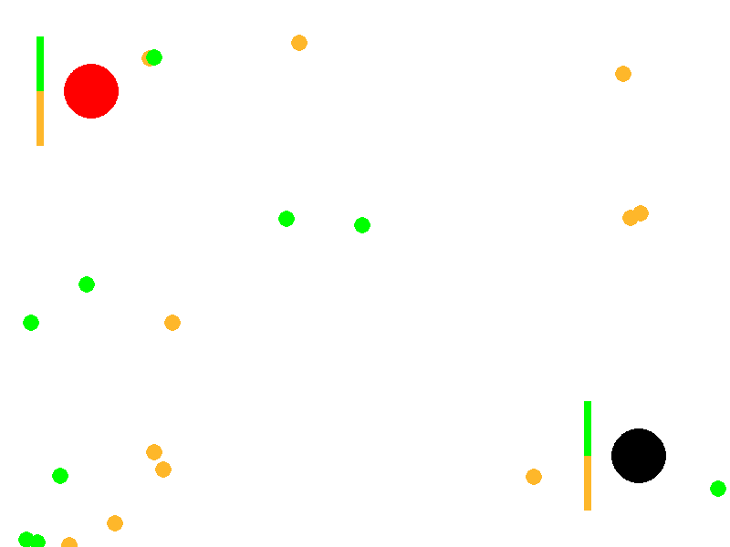
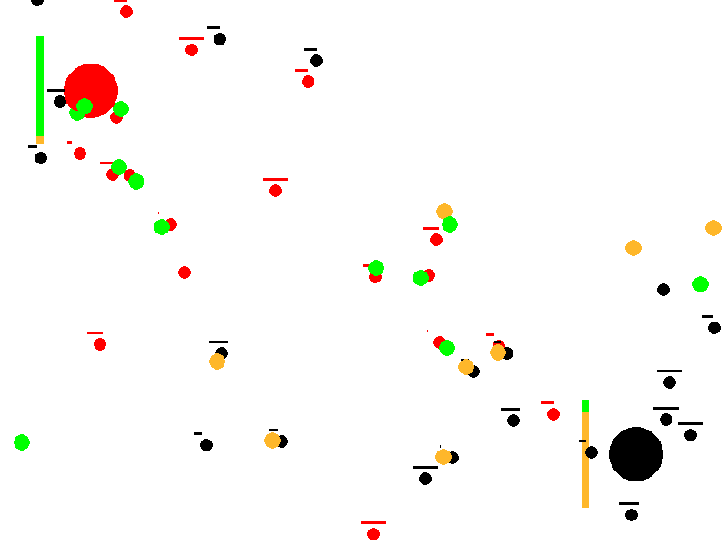
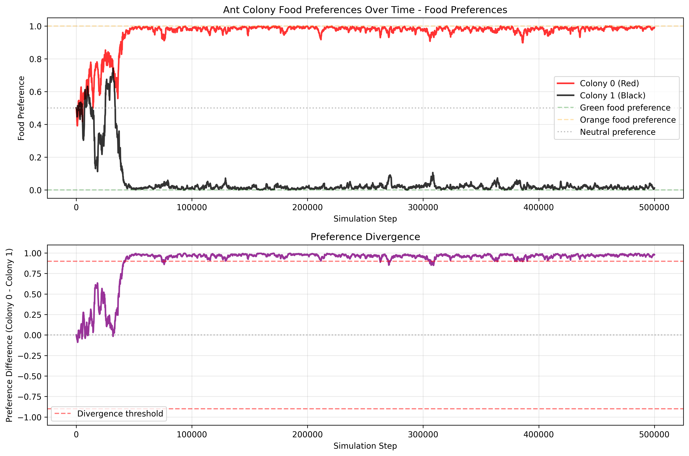
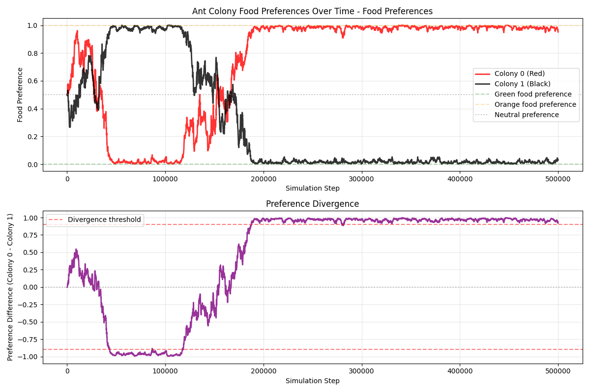
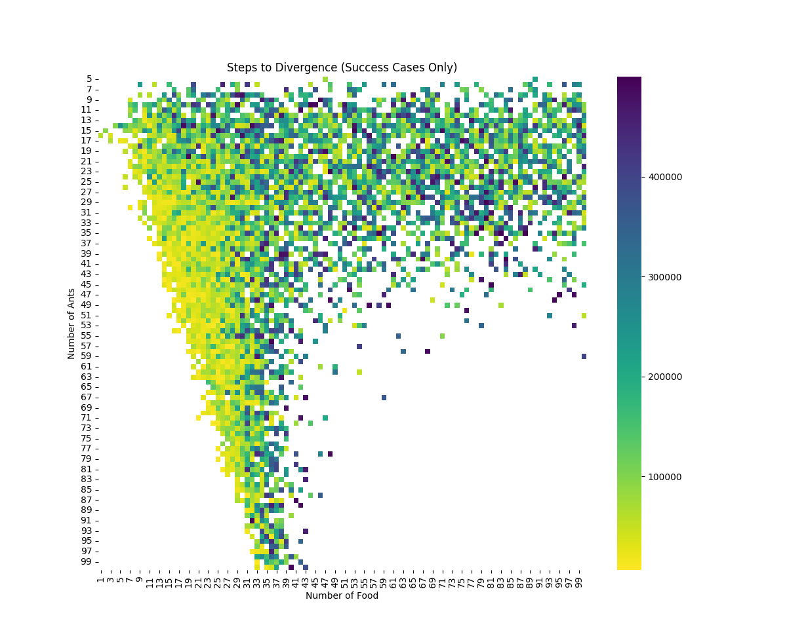
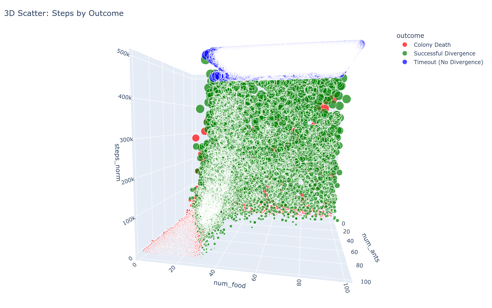

# Emergence from Simple Rules: A Two‑Colony Ant Simulation

## Summary

This article describes a conceptual simulation that explores how simple, local rules can produce complex collective behavior. Two ant colonies (red and black) forage in the same environment for two types of food (green and orange). Without any centralized control, reward function, or in‑lifetime learning, the colonies often drift toward specialization—one population comes to prefer green food, the other orange—thereby reducing direct competition. Depending on resource scarcity and conflict, the system either stabilizes into a specialized equilibrium or collapses when a colony goes extinct.

For source code and details, see the **[GitHub repository](https://github.com/KintaroAI/ants)**.

---

## Purpose and What This is Trying to Show

- **Evolution of Preferences**: Colonies start with neutral food preferences (50% green, 50% orange). Through successful foraging and reproduction, preferences reinforce and diverge, modeling a form of genetic or cultural evolution. One colony may specialize in green food while the other focuses on orange, reducing direct competition.
  
- **Resource Competition and Conflict**: Ants not only gather food but also chase and fight enemy ants carrying desirable food, leading to deaths and resource drops. This shows how scarcity (limited food) impacts colony survival.

- **Emergent Specialization and Survival Dynamics**: The simulation tests whether colonies can achieve a "wanted state" of polarized preferences (e.g., one >95% green preference, the other <5%), representing efficient resource partitioning. It also tracks colony extinction if all ants die from fights or failure to reproduce.

- **Why This Matters**: This could be a model for studying biological phenomena like niche partitioning in ecology, evolutionary algorithms in AI (via preference inheritance and mutation), or social dynamics in competing groups. It's designed for experimentation—varying parameters like ant count, food count, or learning rate to observe outcomes (e.g., does more food reduce deaths? Do preferences always diverge?).

The mechanics mimic evolutionary algorithms rather than reinforcement learning: individual ants have fixed preferences set at creation (like genes), and colonies evolve over "generations" through selection (successful foragers reproduce with random mutations) and removal (deaths from conflict), without agents updating behaviors during their lifetime. Randomness in mutations and choices drives variation, with specialization emerging implicitly from survival pressures, such as reduced fights over different foods, without pre-encoded goals beyond basic foraging rules.

## Core Dynamics

The simulation's main dynamic revolves around a purely evolutionary process driven by random variation and natural selection, without any explicit learning, optimization functions, or predefined target states. Here's a breakdown:

- **No Learning, Only Genetic Variation**: Individual ants do not learn or adapt their behavior during their lifetime; their food preference (a value between 0.0 for orange and 1.0 for green) is fixed at "birth" and acts like a genetic trait. When an ant successfully returns food to the colony, it spawns a new ant with a slightly mutated preference (varied by ±0.1 via the mutation rate). Unsuccessful ants (those killed in conflicts or failing to reproduce) are removed, effectively selecting for traits that lead to survival and reproduction. This mimics Darwinian evolution: variation through random mutation, inheritance to offspring, and differential survival based on environmental fit.

- **Absence of Target State or Fitness Function**: There is no encoded goal, reward system, or fitness function guiding the process toward a specific outcome (e.g., no penalty for non-specialization or bonus for divergence). The "wanted state" of polarized preferences (one colony >0.95 for one food type, the other <0.05) is merely an observer-defined stopping condition for analysis, not a driver of the simulation. Outcomes like specialization or extinction emerge solely from bottom-up interactions, not top-down design.

- **Interactions with the Environment**: The environment is a bounded 800x600 grid with randomly placed food items (green or orange) that respawn upon collection or ant death. Ants interact via:
  - **Sensing and Foraging**: Ants perform random walks unless they detect food or enemy ants within a 50-unit vision radius. They probabilistically target food matching their fixed preference, introducing bias without learning.
  - **Competition and Conflict**: Ants can chase enemy ants carrying preferred food, leading to collisions where both lose life points if one is carrying food. This creates indirect selection pressure: preferences that reduce overlap (e.g., one colony favoring green, the other orange) lower conflict rates, as ants are less likely to fight over the same resources.
  - **Resource Scarcity**: Limited food (default 20 items) forces competition; successful foraging replenishes colony ants, while failures lead to decline. The environment is dynamic—food respawns randomly—but neutral, with no adaptive changes beyond ant actions.

Overall, the dynamic highlights how complexity arises from simplicity: random genetic drift, combined with environmental pressures (scarcity, competition), can lead to adaptive specialization without any intelligent design or learning mechanism.

---

## Typical parameters

These are representative, not prescriptive:

* **Population size:** \~80 ants total, split evenly between colonies.
* **Food availability:** \~40 items present at once, respawning on collection; dropped on death stays in place.
* **Speed:** Mobile ants move faster when foraging than when carrying.
* **Vision radius:** Finite sensing distance (e.g., on the order of a few body lengths).
* **Mutation size:** Small perturbations (e.g., ±0.1 on the 0–1 preference scale).
* **Duration:** Long runs (hundreds of thousands of steps) to allow population‑level shifts.

---

## Stop conditions (for analysis)

* **Time horizon reached** (maximum steps or wall‑clock time).
* **Preference divergence** (e.g., one colony > 0.95 green, the other < 0.05).

* **Extinction** of one or both colonies.

---

## What repeated runs tend to show

* **Start vs. end states:** Colonies typically begin with neutral preferences near 50/50 and often end with distinct, polarized preferences—an indicator of specialization.
* **Divergence distribution:** The time to reach divergence varies widely, with **fastest divergences near the edge of extinction** (a phase‑transition‑like regime).

* **Preference swaps:** Roles can flip mid‑run, underscoring that the specialized equilibrium is dynamic rather than hard‑coded.

* **Steps to Divergence Analysis:**

Steps to Divergence Results from 10,000 simulations showing the distribution of steps required for divergence. Note that the fastest divergence occurs at the edge of extinction, indicating a critical phase transition.

* **3D Visualization of Divergence Patterns:**

Three-dimensional visualization of the divergence patterns, providing additional perspective on the relationship between simulation parameters and outcomes.

---

## Ideas for experiments (conceptual)

* **Resource pressure:** Reduce or increase the number of active food items to study how scarcity changes conflict, death rates, and the probability of specialization vs. collapse.
* **Population pressure:** Vary the total ants to explore density effects. Do crowded worlds intensify conflict and slow divergence?
* **Mutation size:** Adjust the preference mutation to test how exploration vs. exploitation shapes outcomes.
* **Vision radius:** Change sensing distance to probe how information access impacts competition and coordination.
* **Post‑divergence stability:** After a clear split, track how often **preference swaps** occur and what perturbations trigger them.

---

## Extensions & research directions

* **Multi‑resource worlds:** Add more than two food types and study higher‑dimensional niche partitioning.
* **Spatial heterogeneity:** Introduce regions with different resource mixes or obstacles to test habitat specialization.
* **Asymmetric colonies:** Start with different sizes or initial preferences; explore invasion dynamics and resilience.
* **Richer genetics:** Replace the single‑trait preference with multi‑trait genotypes; explore recombination or variable mutation.
* **Learning vs. evolution:** Compare this purely evolutionary setup to agents that update preferences within a lifetime.
* **Analytic metrics:** Track conflict rate, resource share, and reproductive success to quantify equilibria.

---

## Takeaway

In simple terms: a few basic rules lead to big, sometimes surprising patterns. Two colonies that start the same can end up splitting the food between them, swapping roles, or even losing a colony. No one is in charge, and there’s no built‑in learning or goal—the outcomes come from many small, local choices and limited resources. That’s why this setup is useful: it shows how scarcity and competition can shape group behavior without any central control.
