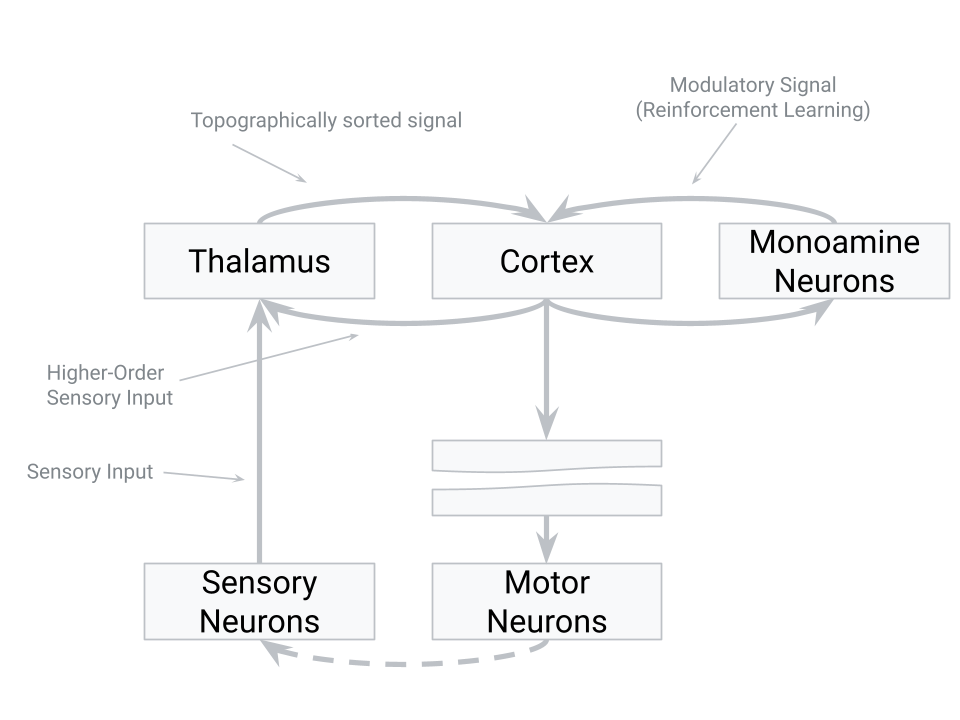
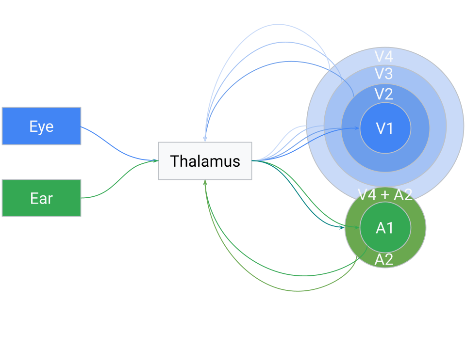

## Introduction: Intelligence as Prediction in Time

[**Intelligence is an emergent property of a system that is trying to predict the future**](/docs/definition-of-intelligence/). The brain is often described as a **prediction machine**, using memory of past patterns to anticipate upcoming events. According to this view, a neural spike – the basic input signal in the brain – represents an **event in time**, and intelligence arises by learning the temporal patterns of these events and their likely futures. As Jeff Hawkins famously put it, *“the brain uses this memory-based model to make continuous predictions of future events... it is the ability to make predictions about the future that is the crux of intelligence”*. This means that **the timing and order of events matter** immensely: our neural architecture is built to capture when events occur and in what sequence, so it can foresee what comes next.

## Overview of the Proposed Intelligence Structure

To understand natural intelligence (and inspire artificial general intelligence), we can outline a two-principle architecture derived from how the brain processes sensory information. In simple terms, the brain uses thalamus as a **hub** to sort incoming signals and a **structured cortex** to recognize patterns. Below is a diagram illustrating the overall structure of this idea:

## The Thalamus-Cortex Loop: A Unified Processing Circuit

A central proposal in our model is that the brain’s core algorithm relies on a **recurrent loop between the thalamus and the neocortex**, rather than a simple feed-forward stack of layers. The **thalamus** serves as a hub that **receives both raw sensory data and cortical feedback at the same time, without distinguishing between them**. From the thalamus’s perspective, there is no flag marking whether a signal came from the retina or from V2 — they all arrive as part of the same undifferentiated stream of activity. In other words, **the thalamus treats all incoming activity as one continuous flow of “events” in time**.

What the thalamus does is **sort and organize these mixed signals according to their correlations**, grouping synchronous or highly related events together. (One can think of this as building a correlation matrix of neuronal inputs, much like a transformer’s self-attention map, where statistical coherence in time drives the arrangement.) The result is a **topographically structured output**, where neurons that carry strongly correlated information end up mapped closer together in the thalamic output projection.

This **organized output is then sent to the neocortex**, which interprets, categorizes, and abstracts the patterns. Importantly, the cortex then **sends its results back into the thalamus as feedback**, but the thalamus doesn’t treat them as different in kind from sensory input — it integrates them into the same pool. For this reason, we call cortical outputs “*higher-order sensory input*.” The loop thus runs continuously: thalamus → cortex → thalamus, with each cycle mixing new external events with the cortex’s latest interpretations. Because the thalamus does not know or care whether a signal originated in the outside world or the cortex, the sorting process gradually **generalizes** the brain’s structure: low-level sensory streams eventually require little sorting, while higher-order abstract signals in cognitive areas undergo extensive integration over long periods of time.

## Hierarchical Areas as an Emergent Property (Not Hardwired Layers)

An important consequence of this loop is that **the classical hierarchy of brain areas (V1, V2, V3, A1, etc.) can emerge dynamically**, not from a fixed, pre-wired design. As the system cycles, the thalamus’s correlation-based sorting naturally clusters related signals. For instance, visual inputs (both direct retinal activity and cortical visual feedback) will tend to end up grouped together in thalamic output space, and the same for auditory inputs. Over time, this leads to the familiar **separation of modalities** in cortical maps, with higher-order integrative areas forming where modalities consistently converge.

What looks like a cortical hierarchy — V1, V2, V3, etc. — is in this view **an emergent organization**. Each cortical region specializes not because it occupies a fixed rung in a ladder, but because the thalamus sorted inputs in such a way that that region consistently receives certain correlated patterns. Those regions then learn to process those signals efficiently, returning their abstracted results to the thalamus. The thalamus mixes those high-level “predictions” or features with new sensory events, again sorting the whole pool into a coherent map.

Because the **sorting is fundamentally temporal**, cross-modal associations can emerge when different signals consistently occur in close sequence. If a particular visual cue and a sound repeatedly co-occur, the thalamus may position them adjacently in its output (i.e. V4 + A2), prompting the cortex to learn a combined representation. Over many cycles, this mechanism naturally builds **hierarchical and cross-modal associations**, not as a static architecture but as the statistical outcome of a system trying to predict sequences of events in time.

## Fundamental Principle 1: The Thalamus as a Signal-Sorting Hub

The first fundamental principle addresses what we can call the “connectivity problem.” Imagine you need to connect an eye to the brain’s visual cortex. The optic nerve leaving the eye contains about one million axons, and the cerebral cortex expects visual signals to be **topographically arranged** – meaning the image projected onto the brain should preserve the spatial order of the retina (so that adjacent points on the retina connect to adjacent points in the cortex). How could nature implement this mapping reliably? There are a few conceivable approaches:

1. **Approach 1: Grow the eye out of the neocortex.** In other words, build the eye directly as an extension of the brain so that wiring is inherently aligned. This is wildly impractical – you would have to grow many organs (eyes, skin receptors, ears, etc.) out of the brain in precise ways.

2. **Approach 2: Use chemical guidance for each axon.** The developing eye’s axons could follow molecular signals that guide each fiber to exactly the right spot on the cortex, theoretically giving a one-to-one mapping. However, this approach is extremely complex. Encoding the precise targeting of a million nerve fibers in DNA is error-prone and vulnerable to mutations. Remember, the brain must also map the skin’s touch receptors, the ears, muscles, and so on. A slight wiring error could scramble the signals (for example, swapping two regions). Yet in practice our sensory maps are remarkably consistent and reliable.

Additionally, the brain can adapt to transformations. In psychologist George Stratton’s famous inverted glasses experiment, after a few days of wearing goggles that flipped his vision upside-down, his perception adjusted and he began to see the world normally. When he removed the goggles, his brain again needed time to re-adapt to normal vision. This suggests the brain’s wiring isn’t absolutely fixed; it can reorganize to correct for distorted input. Similarly, in gradual visual degradation (such as retinal degeneration), people don’t notice black voids appearing in their vision like dead pixels on a screen. Instead, the image “collapses” or fills in – the brain merges the surrounding visuals, and the overall picture just becomes blurrier over time rather than showing dark gaps. (In fact, even a healthy eye has a blind spot where the optic nerve exits, but the brain seamlessly fills in the missing area with surrounding patterns, so we aren’t aware of a hole in our vision.)

1. **Approach 3: Use an intermediate sorting hub (the thalamus).** In this scenario, the eye connects first to an intermediary structure – the thalamus – which in turn has organized projections to the neocortex. The idea is that the thalamus can take a scrambled initial input and gradually **sort it into a meaningful order** before sending it to the cortex. This sorting isn’t instantaneous or hard-coded; it could be a slow, dynamic process where connections adjust based on activity. Over time, signals that frequently occur together (in time or space) will be pulled closer together in the thalamus’s output map. In essence, the thalamus would learn to topographically arrange the signals from the eye so that the image sent to the cortex is sensible. This hypothesis aligns with the known role of the thalamus as a sensory relay and filter – it is often described as the brain’s “gateway” that decides what information passes on to the cortex. Here we propose it not only filters but also performs a **sorting** function, organizing inputs by similarity.

In nature, **Approach 3** is essentially what happens. The thalamus (specifically, for vision, the lateral geniculate nucleus) receives the raw signals from the retina and relays those signals to the primary visual cortex in an ordered way. How might the thalamus achieve the correct ordering? Likely through activity-dependent refinement: connections that make sense (i.e. preserve spatial and temporal correlations) are strengthened, while aberrant or noisy mappings are pruned or re-routed. Over developmental time (and even throughout life), the thalamus can adjust its relay so that the cortex gets a coherent map.

This principle also provides an explanation for certain optical illusions and adaptive perceptions. For example, some static visual illusions **appear to have motion** – one theory is that the thalamus is trying to collapse repetitive patterns in the input. When it sees very similar signals in a patterned image, it may mistakenly merge them or oscillate between interpretations, creating an illusion of movement. The thalamus is essentially looking for consistency and grouping things that occur together. Once the thalamus has sorted and cleaned up the input, it projects the result onto the neocortex in a neat, topographically organized way.

In summary, the thalamus serves as a crucial hub that receives messy, high-dimensional sensory data and refines it into an organized form for the cortex. It acts as a relay station (all senses except smell route through it) and a filter/gate for attention, but also (in this proposed view) a self-adjusting **mapper** solving the connectivity problem. This hub doesn’t distinguish between raw sensory signals and feedback from higher brain areas – it integrates **all incoming signals** as a unified stream, dynamically sorting them by similarity. This ability to sort out signals over time gives the brain a robust way to wire itself correctly without needing an impossibly detailed genetic blueprint for every connection.

## Fundamental Principle 2: The Neocortex as a Pattern-Seeking Columnar System

The second fundamental principle involves the **neocortex** – the large, six-layered sheet of brain tissue responsible for most higher-order processing (sensory perception, movement, reasoning, etc.). The neocortex is organized into vertical structures called **cortical columns**, roughly 0.5 mm in diameter and spanning all six layers. These columns are often thought of as repeating functional units of the cortex. Each cortical column tends to respond to a particular pattern or feature in its input region. For example, in the primary visual cortex, one column might activate when it “sees” a vertical edge in a small patch of the visual field, while a neighboring column responds to a horizontal edge, and another to a 45° diagonal line. Together, a whole array of columns can represent many features of an image.

This raises a crucial question: Who or what **programs** these cortical columns to respond to specific patterns? Why does one column end up detecting vertical lines and its neighbor diagonal lines? One might think the instructions are coded in the DNA – but that would be incredibly inflexible. Hard-coding every possible feature detector for every environment would be impossible (imagine pre-programming a brain for every visual scene, every language, or every culture it might encounter). Instead, nature employs a clever strategy: rather than pre-defining the patterns, it sets up an environment in which columns can **self-organize** based on sensory experience.

Here’s how that self-organization might work, given the structure of the cortex: The neocortex is built as a mostly uniform set of layers and neurons. There are different types of neurons in each layer (some excitatory, which activate others, and some inhibitory, which suppress others). At birth, before significant sensory input, the cortex isn’t yet specialized – it’s like a blank computing sheet with enormous potential.

Once sensory data starts flowing in (after birth, as the infant begins seeing, hearing, touching), the cortical neurons start responding. Imagine a small area of cortex receiving input from the thalamus (say, a patch corresponding to part of the visual field). Within that area, neurons will start firing when they detect something in the input. Excitatory neurons that happen to match the input pattern will fire strongly and try to drive the output of that area (sending a signal to higher cortical areas). Meanwhile, inhibitory neurons are also activated and will try to shut down the activity of neighboring neurons and nearby columns. This setup – an excited neuron or column suppressing its neighbors – is a form of **lateral inhibition**, a common mechanism in neural circuits for enhancing contrast and enabling competition.

In the beginning, many neurons might react similarly (since nothing is tuned yet), and one column could accidentally dominate, suppressing others all the time. However, the cortex has built-in safeguards: neurons that are overloaded (firing constantly) will start to fatigue or reduce their sensitivity, and neurons that are underutilized will become more sensitive over time. In fact, neurons can even fire spontaneously if they remain too silent, just to recalibrate themselves. This is known as **homeostatic plasticity** – a balancing act that prevents any one region from hogging all the activity indefinitely.

Over time, this competition and balancing act causes **specialization**. Suppose Column A and Column B are neighbors receiving the same input area. If Column A happens to respond strongly to a certain pattern (say, a vertical stripe) and keeps “winning,” it will inhibit Column B during those moments. Column B, being suppressed whenever vertical stripes appear, will look for a different pattern that it can win on – perhaps a horizontal stripe. When a horizontal pattern shows up in the input, Column B gets its chance to fire and then inhibits Column A. If Column A were trying to respond to *everything*, it would burn out; but it can’t, because when the input changes, another column takes over. Gradually, Column A and Column B **carve up** the set of possible inputs – one becomes highly sensitive to vertical patterns, the other to horizontal patterns, for instance – each column tuning itself to its preferred feature and responding less to others.

There is also a pruning process: neurons or entire columns that consistently fail or prove redundant will weaken and may eventually die off, while successful ones that find a niche pattern will stabilize. Moreover, neurons that fire together frequently will strengthen their connections with each other (“neurons that fire together, wire together”), reinforcing the coherence of a column that is tuning to a specific feature.

Through these processes, the neocortex essentially forms a set of **filters** or detectors that span the space of common patterns in the sensory input. Each cortical column ends up tuned to a different feature, minimizing overlap with its neighbors. In our vision example, you get a diverse set of edge detectors, color detectors, movement detectors, etc., rather than all columns doing the same thing. This distribution of labor means the sensory input is encoded efficiently – adjacent columns aren't wasting resources by all detecting the exact same edge; instead they each focus on different elements of the image. Overall, this process is similar to the mechanics happening in [Ants Simulation](/blog/2025/09/13/ants/).

One key function of the neocortex, therefore, is to recognize patterns in the incoming data and represent those patterns efficiently **without redundancy**. It finds common features (like edges, shapes, tones, textures, etc.), while also ensuring that neighboring columns specialize in different features. The “winning” column at any moment (the one whose pattern best matches the current input) will send its output up to higher regions of the cortex. Meanwhile, inhibitory feedback keeps the overall representation sparse, preventing many columns from firing for the same feature.

This principle – self-organizing feature detectors under competitive and cooperative interactions – allows the brain to flexibly adapt to whatever environment it’s in. The DNA doesn’t need to specify “column 37 shall detect 45° lines”; it only needs to build the general cortical circuit rules. The data itself then tunes the cortex. If an animal lives in a world with mostly vertical trees, many columns might end up highly sensitive to vertical patterns. If the environment changes, the cortical tuning can gradually adapt as well.

## Layered Processing and Feedback Loops

Now that we’ve covered how one layer of cortex can learn a set of features from raw sensory input, the next question is: how do we build **multiple layers** of processing and connect different brain regions together? In our proposed structure, the solution is to repeat the same thalamus–cortex principle at multiple scales, in a looped fashion (rather than a simple one-way stack).

Think of the output from the first cortical layer as a kind of “higher-order” sensory input. The primary sensory cortex (e.g. primary visual cortex for vision) extracts basic features like lines or simple shapes. Those outputs (patterns of activity representing the presence of certain features) can themselves be treated as inputs that need to be further organized and interpreted. This is where the thalamus comes into play again. The cortical output is sent back to the thalamus (typically to a higher-order thalamic nucleus associated with the next cortical area). The thalamus at this stage performs a similar job as before: it takes the feature signals from the first cortical area and sorts/organizes them topographically before relaying them to the next cortical region. In essence, the cortex’s feedback to the thalamus acts as **“higher-order” sensory input** – the thalamus treats cortical outputs just like raw sensory signals, merging them into the stream of incoming events to be sorted.

For example, in vision, primary visual cortex (V1) might send information about detected edges back to the thalamus (perhaps to the pulvinar nucleus), which then relays a cleaned-up, combined “edge map” to a secondary visual area (V2). In V2, new cortical columns will respond to combinations of edges – perhaps detecting angles or corners (where two edges meet), or more complex shapes like rectangles or circles. Again, those columns in V2 compete and specialize as described earlier. The output of V2 can loop back to the thalamus and then up to V3, and so on. Each level extracts increasingly abstract or complex features from the level below, using the same cycle: cortical columns find patterns, output to thalamus, thalamus re-integrates and projects to the next area.

Although we describe this progression in terms of distinct “layers” (V1 → V2 → V3, etc.), it’s important to note that this hierarchy **emerges** from the looping architecture rather than being rigidly hardwired. In practice, the thalamus’s sorting process will tend to cluster signals by type and correlation, naturally giving rise to something that looks like a hierarchy of cortical areas. Each cortical region (like V1 or A1) specializes in a certain domain not because it was pre-assigned a role, but because the thalamus dynamically routed a particular subset of correlated signals to that region. Over time, those cortical areas self-organize to efficiently handle the signals they receive. They then send summarized or abstracted results (e.g. a recognized feature or pattern) back to the thalamus, which in turn mixes those high-level **“predictions”** or features with new sensory data. In essence, the thalamus is continuously blending bottom-up sensory events with top-down cortical interpretations and resorting them. Highly related signals end up mapped next to each other in the thalamus’s output, meaning that if a high-level cortical pattern regularly coincides with a certain sensory feature, the thalamus will group them and forward them together into the cortex on the next cycle. This dynamic loop accounts for how a hierarchy of perception can form without an explicit blueprint – the “layers” are an emergent property of iterative sorting and feedback.

This looping architecture also ensures that each connection between brain regions isn’t a fixed, brittle wiring, but rather a **malleable, sorted link** via the thalamus. If some connections degrade or if the inputs change, the thalamic relay can adjust. It also means that if one sensory modality is absent (say a person is born blind), the brain can potentially use that cortical real estate for another sense. The thalamus will simply route other available inputs (perhaps touch or hearing) into the vacant areas, because from the thalamus’s perspective, it’s all just “sensory” data. This kind of re-routing is seen in sensory substitution and cross-modal plasticity: for example, blind individuals can use touch or sound-based inputs (like braille or echolocation clicks) and these inputs will activate the visual cortex, effectively repurposing it for new functions. The architecture is inherently flexible – the thalamus doesn’t “know” which signals are visual or tactile per se; it just sorts whatever signals it receives and allocates cortex to them accordingly.

The pattern of **thalamus → cortex → thalamus → cortex** repeats multiple times, yielding what appears to be a hierarchy of processing. Lower levels handle simple, localized patterns; higher levels handle complex, abstract patterns (like object recognition, spatial relationships, or eventually semantic concepts). At the highest levels, we have association cortex or integration areas, where inputs from different sensory modalities come together. Interestingly, the same principle can explain why different senses sometimes converge on similar perceptions: if certain patterns from vision and hearing frequently coincide (imagine seeing lightning and then hearing thunder), over time the brain links those in an association area. The thalamus will have sorted those signals to the same region of cortex because they were correlated in time and pattern. Thus, we develop integrated multi-sensory understandings of the world.

One challenge in this continuously updating loop is maintaining **stable representations**: as new correlations form or old ones fade, the thalamus’s output mapping might drift over time, potentially forcing the cortex to re-learn shifting input patterns. The neocortex addresses this using **horizontal (lateral) connections** that link neurons across different cortical regions. These long-range cortical connections help stabilize cortical maps and also speed up the recognition of familiar patterns. If two cortical regions frequently activate together or in close sequence, the cortex strengthens direct connections between them – a Hebbian mechanism often summed up as “cells that fire together, wire together.” These lateral bonds act like an anchor on the cortex’s activity map: once a group of cortical neurons forms a stable representation for a particular pattern, they will not be easily pulled apart by minor rearrangements in the thalamus’s input. In effect, horizontal connections gently **stabilize** the cortex’s interpretations. So if the thalamus keeps trying to sort the same cluster of signals in slightly different ways, the cortex’s lateral links between those neurons will resist large changes, preventing the representation from drifting too far. (Of course, these connections aren’t absolutely rigid; if a drastic change occurs – for example, an eye is lost and all its signals vanish – the thalamus’s new sorting will eventually overwrite and re-tune the horizontal connections, allowing the cortical map to reorganize around the new reality. But under normal conditions, lateral connections provide a locking effect that keeps established patterns consistent.)

These horizontal connections also allow the brain to **anticipate** and fill in patterns more quickly. As soon as one cortical region becomes active from an incoming stimulus, it can directly excite another region that it knows usually follows, without waiting for the full thalamus→cortex→thalamus loop to complete. For example, if pattern A in region X typically precedes pattern B in region Y (think of a sequence of notes in a melody, or strokes in a written word), then when region X detects A, its lateral links can immediately pre-activate the neurons in region Y that represent B. In this way the higher-order area is “warmed up” to expect B almost right away. This significantly accelerates recognition and prediction. Known patterns can be recognized from just a fragment of input, because the cortex, via its horizontal connections, effectively auto-completes the sequence internally. Neurophysiologically, this aligns with observations of **anticipatory neural activity** – cells firing in advance of a predicted sensory event. The lateral connections implement a form of in-context prediction: the cortex internally simulates likely next inputs, ensuring that the whole loop doesn’t have to start from scratch at every moment. Not only does this speed up perception, but it also helps reinforce the precise timing relationships (the order of firing events) that the thalamus is trying to sort out. In summary, the cortex’s web of lateral links makes the thalamus-cortex loop both **stable** (learned maps don’t jitter with every fluctuation) and **efficient** (familiar patterns are completed and recognized with minimal latency).

## Adaptive Mapping and Neuroplasticity

A final set of questions arises: how does the brain **know** how to arrange all this wiring? How does it know, for example, that the visual input should ultimately be projected in an upside-down manner to match the retinal inversion (since the image on our retina is inverted, yet we perceive the world upright after the brain processes it)? How did Stratton’s brain adjust to inverted glasses and then adjust back? How do phenomena like sensory substitution actually work, and why is the brain so plastic that it can reorganize itself in these ways?

The answer is surprisingly simple: the brain doesn’t know the “correct” wiring in advance – it **figures it out on the fly**. Think of the brain at birth as receiving one giant, abstract sheet of sensory data from the world. From the brain’s perspective, your eyes are just specialized patches of “skin” that react to light, your ears are patches of “skin” that react to air vibrations, and so on. All these sensors send streams of signals into the thalamus. Initially, the brain doesn’t label them “vision” or “touch” or “sound” – it’s all just neural activity. The thalamus takes this big jumble of inputs and tries to make an orderly map out of it by relying on the **statistics** of the data itself.

If one set of signals has a lot of internal structure and variety (like the richly patterned signals from the eyes), the thalamus will devote more cortical area to it, simply because there’s more meaningful information to unpack. This is why, for example, our visual cortex is huge compared to, say, the cortical area for our back skin – vision provides an immense amount of detailed spatial information, whereas the skin on our back yields relatively uniform touch information. The more varied and information-rich the input, the larger the cortical territory it ends up with. Conversely, if a region of input is very uniform or inactive, the thalamus might treat that whole region as essentially one signal (collapsing it) and thus only allocate a small patch of cortex to it.

This dynamic allocation is evident in phenomena like the sensory **homunculus** in the somatosensory cortex: body areas with very fine touch discrimination (fingers, lips) have disproportionately large brain areas, whereas areas with coarse sensation (trunk, legs) have much smaller representation. It’s not that the DNA explicitly “built” a bigger cortex for the fingers; rather, the rich input from the fingers during development **claimed** more cortical resources. Likewise, if inputs change – say a person loses their sight – the brain doesn’t leave the visual cortex idle. Over time, auditory and tactile inputs that now carry the most meaningful new information will **invade** and activate the “visual” cortex. In other words, the thalamus and cortex together will reassign that cortical territory to handle other data. This is why blind individuals often have enhanced touch or hearing, and brain scans show their visual cortex lighting up when reading Braille or hearing sounds – the system rewired itself to optimize for the inputs available.

Neuroplasticity experiments support this flexibility. In one study, researchers provided sighted people with an apparatus that translates camera images into patterns of vibrations on the skin (a form of sensory substitution device). After training with this device, the participants’ visual cortex began responding to these touch signals, and the subjects could interpret the tactile input as spatial **vision**. The brain didn’t care that the modality was different; it only cared about consistent patterns and learned to map the relationships in the data accordingly.

In summary, the brain’s strategy is to leverage data and experience to **organize itself**. The thalamus continually sorts and re-sorts inputs at all levels, and the cortex continuously adapts to represent whatever information is coming in, all within the competitive loop framework we described. We end up with a highly adaptable system where **form follows function**: the wiring and maps in the brain are shaped by the content of the information, not by a rigid preset design. This explains why neuroplasticity – the brain’s ability to reorganize and form new connections – is such a powerful feature of intelligence. The system learns to **wire itself** dynamically, rather than relying on an explicit blueprint.

## Conclusion

The two principles outlined here – the thalamus as a dynamic sorting hub and the neocortex as a self-organizing pattern recognizer – offer a blueprint of natural intelligence that could inspire artificial general intelligence designs. Rather than hard-coding every connection or training strictly in a fixed, feed-forward hierarchy, an AGI system might incorporate a **hub-and-loop** architecture (analogous to the thalamus-cortex loop) that flexibly routes and integrates signals, and a competitive modular processor (like cortical columns) that discovers features through data-driven self-organization. The brain’s elegant solution to the connectivity problem – and its ability to continuously re-map itself to fit the data and anticipate future events – are key reasons why biological intelligence is so general and adaptable. Understanding these principles is not only fascinating from a neuroscience perspective, but it may also provide guiding insights for engineers and AI researchers working on the next generation of intelligent systems.

Natural intelligence, in essence, teaches us that it’s not about pre-programming every detail – it’s about designing systems that can **learn to wire themselves**. By mimicking these **loop-based, predictive** strategies, we move one step closer to genuine artificial general intelligence.

