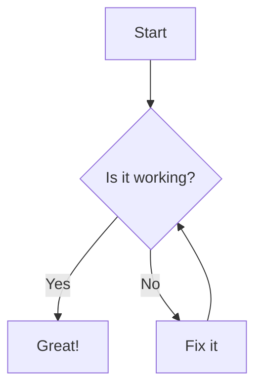
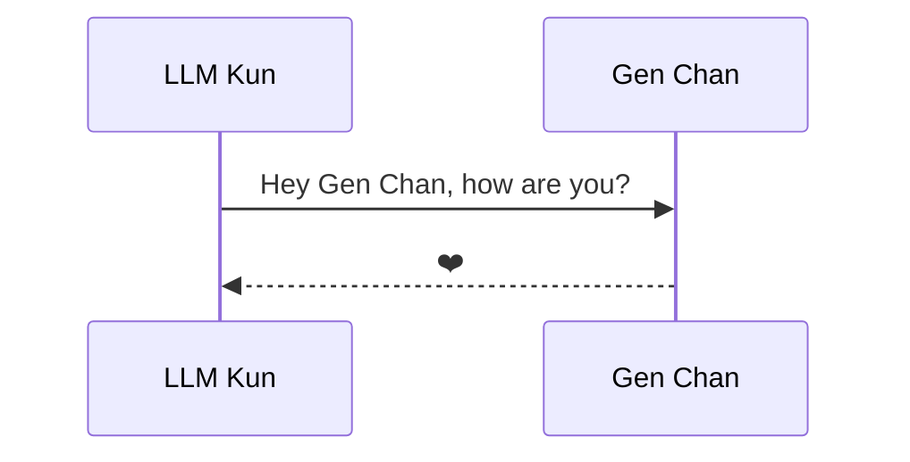
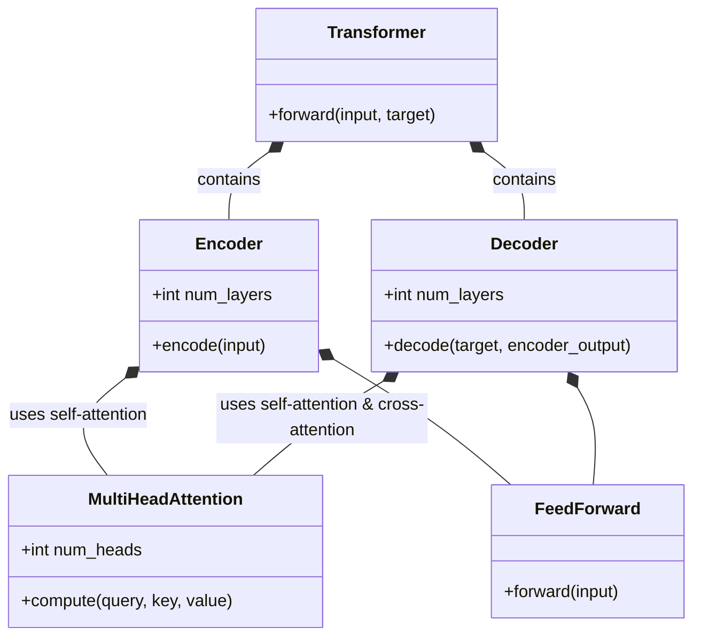

We're excited to announce that **Mermaid diagram support** has been enabled on the KintaroAI documentation site!

## What's New

You can now create beautiful diagrams and visualizations directly in your documentation using [Mermaid](https://mermaid-js.github.io/mermaid/) syntax.

### Example: Flowchart

### Example: Sequence Diagram

### Example: Class Diagram

## Try It Out

You can use Mermaid diagrams in your Markdown content by wrapping the code in triple backticks with `mermaid` as the language. See the [Mermaid documentation](https://mermaid-js.github.io/mermaid/) for more diagram types and syntax.

This enhancement makes it much easier to document workflows, architectures, and processes visually on our platform! 